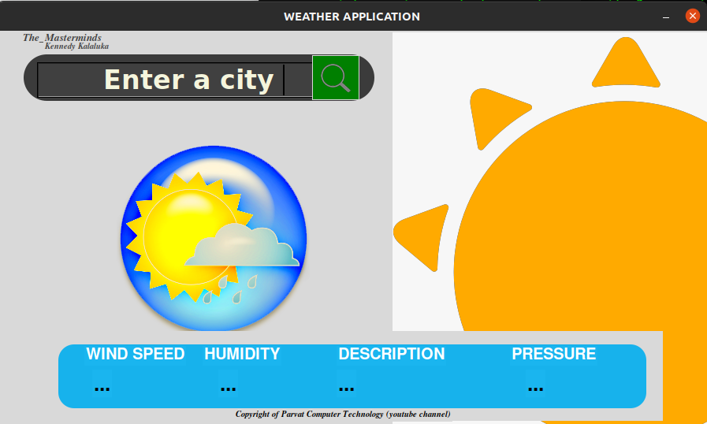
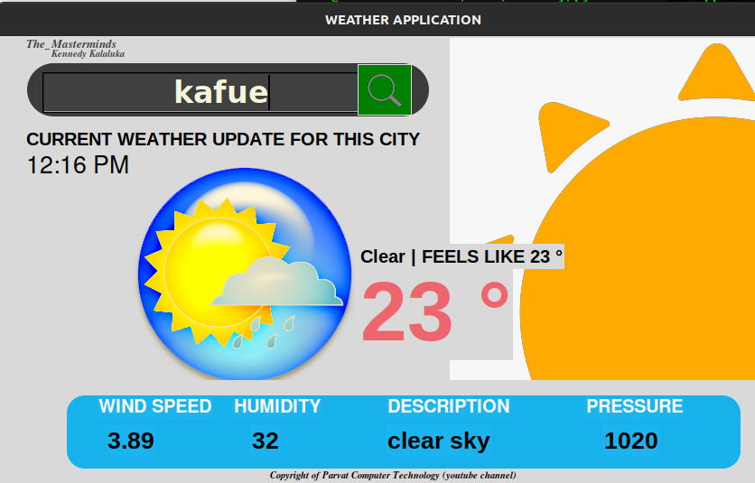

<h1><center>PYTHON WEATHER APPLICATION</center></h1>



A simple python current weather application<br>This application is script based and can be installed by cloning int this [Repository](https://github.com/Kenmind/python-weather_application) and running app.py <br>To read and understand more about this application, you can click on my 
 [Blogpost](https://www.linkedin.com/feed/update/urn:li:ugcPost:6937833795517566976?updateEntityUrn=urn%3Ali%3Afs_updateV2%3A%28urn%3Ali%3AugcPost%3A6937833795517566976%2CFEED_DETAIL%2CEMPTY%2CDEFAULT%2Cfalse%29)

## Environment

### OS
1. Windows
2. Unix systems

### Python Version
This app was developed using python3

### Required Libraries
- Tkinter
	```sudo pip3 install tk or sudo apt-get install python3-tk```
- Geopy
	```sudo pip3 install geopy```
- Timezonefinder
	```sudo pip3 install timezonefinder```
- Datetime
	```sudo pip3 install datetime```
- Requests
	```sudo pip3 install requests```
- pytz
	```sudo pip3 install pytz```

## Installation and Usage


To install this app follow these steps
1. Clone this repo with the following command;
```git clone https://github.com/Kenmind/python-weather_application.git```
2. Type 
```cd python-wheather_application```
3. To run the app, type
```./app.py``` or ```python3 app.py```
4. Enter the name of a City you want to check the current forecast in the text field and hit the search button.

## Bugs
No known bugs yet, if you find any please open a pull request on [this repo](https://github.com/Kenmind/python-weather_application/pulls)


## Related Projects
1. [FoRe](https://github.com/Her-o1/weather_project) By Joy Wanjiru - [Github](https://github.com/Joy879)
2. [5 Day Weather Forecast](https://github.com/jsubroto/5-day-weather-forecast)

## Licensing
This project is licensed under the [MIT License](https://github.com/Kenmind/python-weather_application/blob/main/LICENSE)

## Contributing
Contributions are welcome

## Author
|S/N | NAME | LINKS |
| :---: | :-----: | :----- |
| 1. | Kennedy Kalaluka | [Twitter](https://twitter.com/Kennedy_Sibeso) [Facebook](https://www.facebook.com/kennedysimasiku.kalalukasibeso) [Linkedin](https://linkedin.com/in/kennedykalaluka) [Github](https://github.com/Kenmind) |
